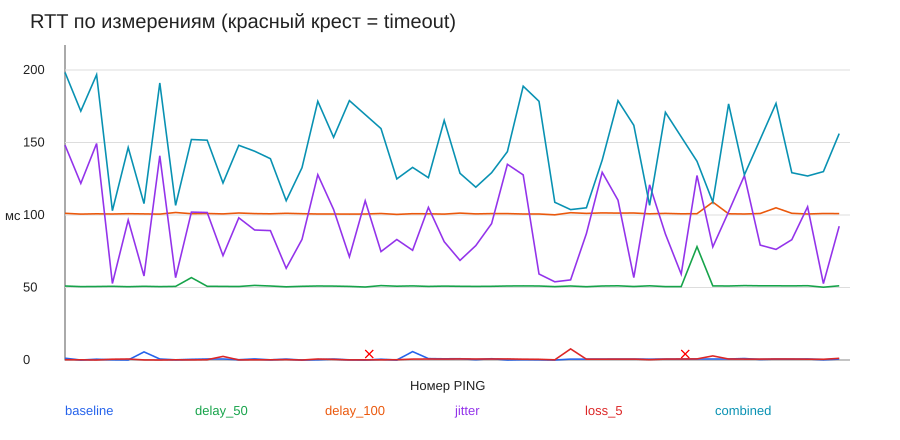
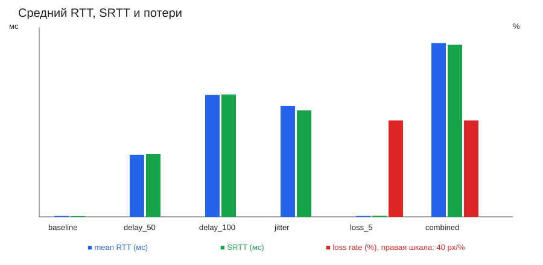
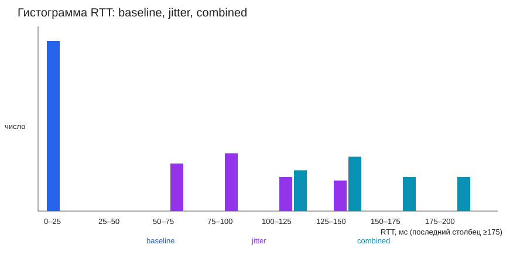

# Отчёт о задержке UDP

Данные: [latency_samples.csv](latency_samples.csv), 2026-09-15, localhost, шесть реальных серий по 50 PING. Параметры указаны в [Experiment_Config.md](Experiment_Config.md).

| Серия | Отправлено | Получено | Timeout | min | max | mean | median | SRTT | джиттер | потери |
|---|---:|---:|---:|---:|---:|---:|---:|---:|---:|---:|
| baseline | 50 | 50 | 0 | 0.000 | 5.768 | 0.687 | 0.607 | 0.580 | 0.735 | 0.0% |
| delay_50 | 50 | 50 | 0 | 50.224 | 78.108 | 51.555 | 50.938 | 52.000 | 1.632 | 0.0% |
| delay_100 | 50 | 50 | 0 | 100.139 | 108.907 | 101.157 | 100.876 | 101.590 | 0.803 | 0.0% |
| jitter | 50 | 50 | 0 | 52.675 | 149.320 | 92.064 | 88.189 | 88.364 | 32.100 | 0.0% |
| loss_5 | 50 | 48 | 2 | 0.000 | 7.657 | 0.683 | 0.556 | 0.856 | 0.656 | 4.0% |
| combined | 50 | 48 | 2 | 102.954 | 198.369 | 144.241 | 141.289 | 142.795 | 31.511 | 4.0% |

RTT, SRTT и джиттер — в миллисекундах. SRTT = 0.875·SRTT + 0.125·RTT (первый RTT инициализирует оценку). Джиттер — среднее |RTTᵢ − RTTᵢ₋₁| по успешным ответам; потери = timeout/sent·100%. Серверные часы в RTT не участвуют.

Потери в loss_5 и combined составили 4%, а не ровно 5%: фиксированное правило каждый 20-й пакет на серии из 50 пакетов пропускает 2 ответа. Встроенная задержка явно указана в конфигурации; это измерение loopback, а не внешней сети.
